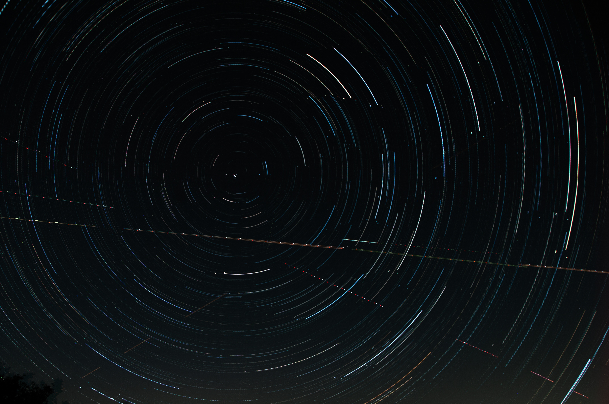

## Star Trails Stacker

A simple star trails stacker using OpenCV. Rather than take star trails using exremely long exposures, we can take many shorter exposures and stack these in software to give the appearance of a long star trail. This has several advantages, including better flexibility, allowing us to salvage some of the image if the camera gets bumped, and allows us to do hour-long star trails in areas with high light pollution without overexposing the sky.   
This was a star trail picture that was stitched together from 154 20-second long exposures to simulate a total exposure time of around 2 hours.

### Prerequisites
* Python 3.9+
* OpenCV
* Numpy

### Usage
1. Create a directory of `.jpg` images of stars, all with the same image dimensions.
2. Call the script from the command line as follows:  
`python3 stacking.py <path-to-dir> --name <output-file-name>`  
`<path-to-dir>` is the path (relative or absolute) that points to the image files, and `<output-file-name>` is an optional argument that allows us to specify the name of the output file. If this is blank, the file will simply be called `out.jpg`.
